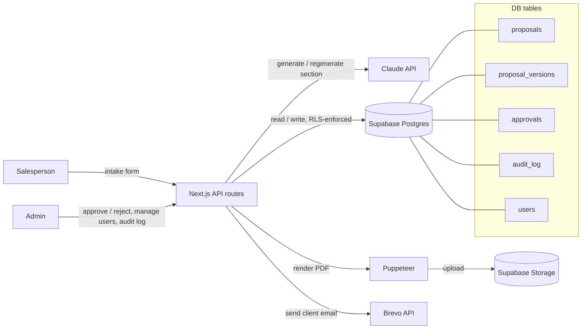
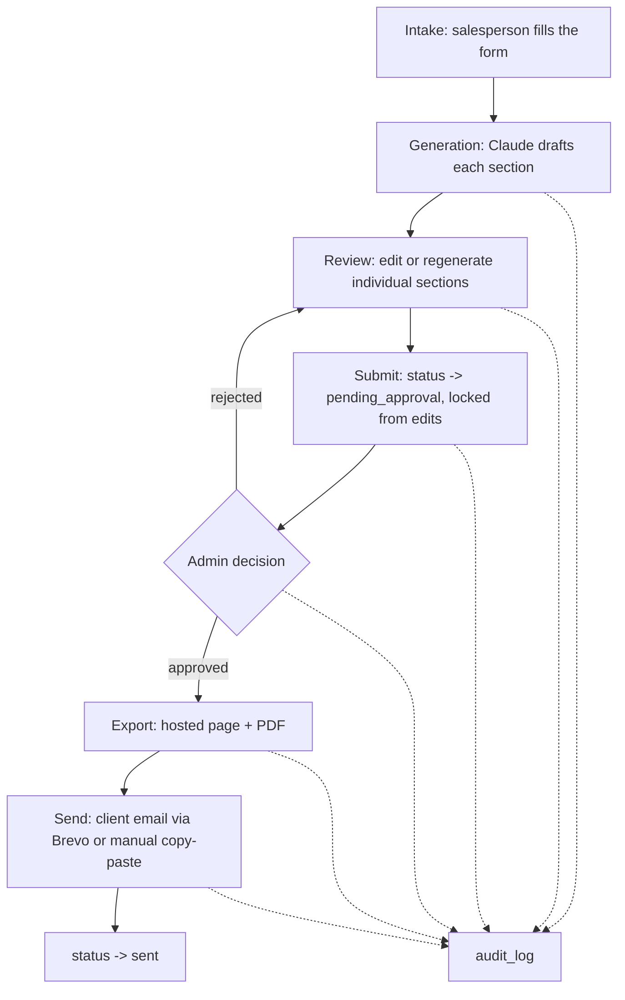

# AI Proposal Generator

**Live app:** [ai-proposal-generator-iota.vercel.app](https://ai-proposal-generator-iota.vercel.app)

An internal tool that turns discovery-call notes into a client-ready proposal. A salesperson
fills in an intake form, Claude drafts each section of the proposal, the salesperson reviews
and edits before submitting, an admin signs off, and only then is the proposal exported and
emailed to the client. Every step — generation, edits, approval, export, delivery — is logged
so failures are debuggable and the flow can't accidentally skip human review.


## Tech stack

| Layer | Choice | Why |
|---|---|---|
| Frontend + Backend | [Next.js](https://nextjs.org) (App Router) | One framework for UI and API routes — no separate backend to deploy. API routes keep the Claude key and role checks server-side. |
| Database + Auth | [Supabase](https://supabase.com) (Postgres) | Email/password auth plus Row Level Security, so role-based access (salesperson sees only their own proposals, admin sees everything) is enforced at the database level, not just in the UI. |
| AI | [Claude API](https://docs.anthropic.com) (`@anthropic-ai/sdk`), called only from server routes | Centralizes cost control (caching, regeneration caps, mock mode) in one place; the key never reaches the browser. |
| Document export | HTML rendered to PDF server-side (Puppeteer / `@sparticuz/chromium`) | Produces both a hosted proposal page (`/p/[id]`) and a downloadable PDF from the same content. |
| Email delivery | [Brevo](https://www.brevo.com) API, with a manual copy-paste fallback if unconfigured | Sends the approved proposal to the client; falls back gracefully so delivery still "succeeds" (the salesperson sends it by hand) if Brevo isn't set up. |

## Architecture



### Flow



Every arrow into `audit_log` above happens on both success **and** failure (e.g.
`export_failed`, `email_failed`), and a failure also flips the proposal's `status` to `failed`
so it's visible on the dashboard, not just in the log.

### Roles

- **Salesperson** — creates proposals, generates/edits/regenerates sections, submits for approval.
- **Admin** — everything above, plus full audit log visibility, user role management, and the ability to override a stuck proposal status.

Each role's permissions are enforced twice: once in the API route (for clear error messages)
and again by Supabase Row Level Security (the actual security boundary).

## Running it locally

### Prerequisites

- Node.js 20+
- A [Supabase](https://supabase.com) project
- An [Anthropic API key](https://console.anthropic.com) (optional for local dev — see mock mode below)

### 1. Install dependencies

```bash
npm install
```

### 2. Set up the database

Apply the SQL files in [`supabase/migrations`](supabase/migrations) to your Supabase project, in
order — either via the Supabase CLI:

```bash
supabase link --project-ref <your-project-ref>
supabase db push
```

or by pasting each file into the Supabase SQL editor in order.

Then create at least one admin user by hand: sign a user up via Supabase Auth, then insert their
matching row into `public.users` with `role = 'admin'`. From there, that admin can invite
salespeople (and other admins) from `/dashboard/admin/users`.

### 3. Configure environment variables

Copy `.env.example` to `.env.local` and fill it in:

```bash
cp .env.example .env.local
```

| Variable | Required | Notes |
|---|---|---|
| `NEXT_PUBLIC_SUPABASE_URL` | Yes | Supabase project URL |
| `NEXT_PUBLIC_SUPABASE_ANON_KEY` | Yes | Supabase anon/public key |
| `SUPABASE_SERVICE_ROLE_KEY` | Yes | Server-side only — needed for audit log / version writes |
| `CLAUDE_GENERATION_MODE` | No | `mock` (default) returns static placeholder text with no API calls; set to `live` for real Claude generation |
| `ANTHROPIC_API_KEY` | Only if `CLAUDE_GENERATION_MODE=live` | Your Claude API key |
| `BREVO_API_KEY` / `BREVO_FROM_EMAIL` | No | If unset, the send step composes the client email for manual copy-paste instead of emailing it directly |

### 4. Run the dev server

```bash
npm run dev
```

Open [http://localhost:3000](http://localhost:3000).

### Other scripts

```bash
npm run build   # production build
npm run start   # run the production build
npm run lint    # eslint
```

## Cost control notes

Since `CLAUDE_GENERATION_MODE` defaults to `mock`, the full UI/approval/delivery flow can be
built and tested without spending any API budget. When switched to `live`:

- Each section is generated independently and cached — regenerating with no changed inputs
  reuses the last version instead of calling the API again.
- Regeneration is capped at 3 real calls per section; past that, the salesperson edits manually.
- A section's "Regenerate" button is disabled while a request is in flight, both client-side and
  via a server-side guard, to prevent duplicate-click spend.
- Supporting material is truncated before being sent as context.
- Token usage is logged per call in `audit_log` metadata.
