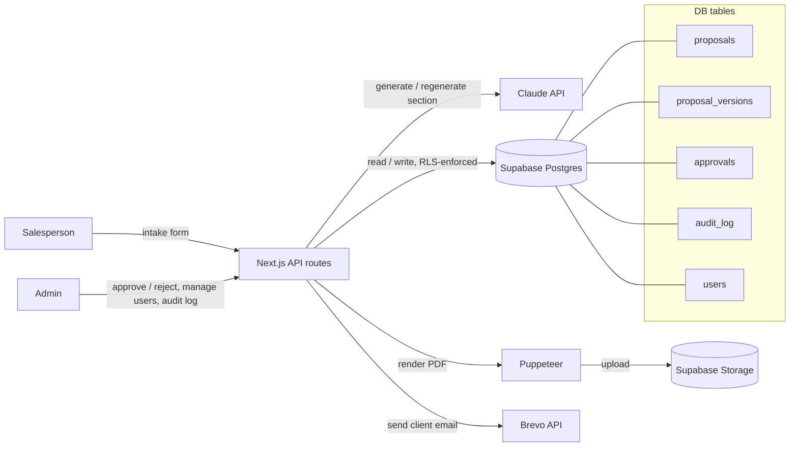
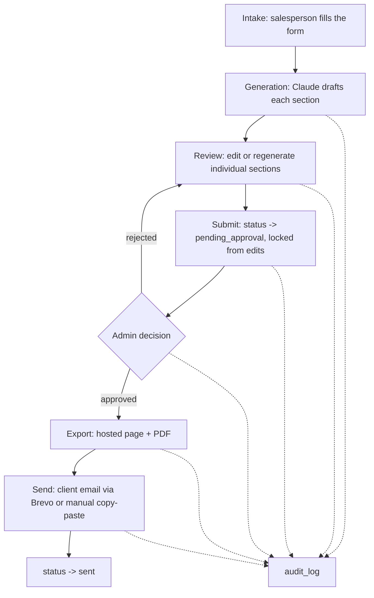

# AI Proposal Generator

**Live app:** [ai-proposal-generator-iota.vercel.app](https://ai-proposal-generator-iota.vercel.app)

An internal tool that turns discovery-call notes into a client-ready proposal. A salesperson
fills in an intake form, Claude drafts each section of the proposal, the salesperson reviews
and edits before submitting, an admin signs off, and only then is the proposal exported and
emailed to the client. Every step, including generation, edits, approval, export, and delivery,
is logged so failures are debuggable and the flow can't accidentally skip human review.


## Tech stack

| Layer | Choice | Why |
|---|---|---|
| Frontend + Backend | [Next.js](https://nextjs.org) (App Router) | One framework for UI and API routes, so there's no separate backend to deploy. API routes keep the Claude key and role checks server-side. |
| Database + Auth | [Supabase](https://supabase.com) (Postgres) | Email/password auth plus Row Level Security, so role-based access (salesperson sees only their own proposals, admin sees everything) is enforced at the database level, not just in the UI. |
| AI | [Claude API](https://docs.anthropic.com) (`@anthropic-ai/sdk`), called only from server routes | Centralizes cost control (caching, regeneration caps, mock mode) in one place; the key never reaches the browser. |
| Document export | HTML rendered to PDF server-side (Puppeteer / `@sparticuz/chromium`) | Produces both a hosted proposal page (`/p/[id]`) and a downloadable PDF from the same content. |
| Email delivery | [Brevo](https://www.brevo.com) API, with a manual copy-paste fallback if unconfigured | Sends the approved proposal to the client; falls back gracefully so delivery still "succeeds" (the salesperson sends it by hand) if Brevo isn't set up. |

## Architecture



### Flow



Every arrow into `audit_log` above happens on both success **and** failure (e.g.
`export_failed`, `email_failed`), and a failure also flips the proposal's `status` to `failed`
so it's visible on the dashboard, not just in the log.

### Roles

- **Salesperson**: creates proposals, generates/edits/regenerates sections, submits for approval.
- **Admin**: everything above, plus full audit log visibility, user role management, and the ability to override a stuck proposal status.

Each role's permissions are enforced twice: once in the API route (for clear error messages)
and again by Supabase Row Level Security (the actual security boundary).

## Running it locally

### Prerequisites

- Node.js 20+
- A [Supabase](https://supabase.com) project
- An [Anthropic API key](https://console.anthropic.com) (optional for local dev; see mock mode below)

### 1. Install dependencies

```bash
npm install
```

### 2. Set up the database

Apply the SQL files in [`supabase/migrations`](supabase/migrations) to your Supabase project, in
order, either via the Supabase CLI:

```bash
supabase link --project-ref <your-project-ref>
supabase db push
```

or by pasting each file into the Supabase SQL editor in order.

Then create at least one admin user by hand: sign a user up via Supabase Auth, then insert their
matching row into `public.users` with `role = 'admin'`. From there, that admin can invite
salespeople (and other admins) from `/dashboard/admin/users`.

### 3. Configure environment variables

Copy `.env.example` to `.env.local` and fill it in:

```bash
cp .env.example .env.local
```

| Variable | Required | Notes |
|---|---|---|
| `NEXT_PUBLIC_SUPABASE_URL` | Yes | Supabase project URL |
| `NEXT_PUBLIC_SUPABASE_ANON_KEY` | Yes | Supabase anon/public key |
| `SUPABASE_SERVICE_ROLE_KEY` | Yes | Server-side only, needed for audit log / version writes |
| `CLAUDE_GENERATION_MODE` | No | `mock` (default) returns static placeholder text with no API calls; set to `live` for real Claude generation |
| `ANTHROPIC_API_KEY` | Only if `CLAUDE_GENERATION_MODE=live` | Your Claude API key |
| `BREVO_API_KEY` / `BREVO_FROM_EMAIL` | No | If unset, the send step composes the client email for manual copy-paste instead of emailing it directly |

### 4. Run the dev server

```bash
npm run dev
```

Open [http://localhost:3000](http://localhost:3000).

### Other scripts

```bash
npm run build   # production build
npm run start   # run the production build
npm run lint    # eslint
```

## Cost control notes

Since `CLAUDE_GENERATION_MODE` defaults to `mock`, the full UI/approval/delivery flow can be
built and tested without spending any API budget. When switched to `live`:

- Each section is generated independently and cached: regenerating with no changed inputs
  reuses the last version instead of calling the API again.
- Regeneration is capped at 3 real calls per section; past that, the salesperson edits manually.
- A section's "Regenerate" button is disabled while a request is in flight, both client-side and
  via a server-side guard, to prevent duplicate-click spend.
- Supporting material is truncated before being sent as context.
- Token usage is logged per call in `audit_log` metadata.

## Testing evidence

End-to-end, against the running app with `CLAUDE_GENERATION_MODE=live` (real Claude calls, real
Supabase, real Brevo send), not mocked.

| Test case | Expected result | Actual result | Passed? | Notes or fix made |
|---|---|---|---|---|
| Normal Proposal Generation | Complete proposal input generates a clear, structured proposal across all sections. | Created a proposal with all 11 intake fields filled. Generated all 7 sections (Introduction, Project Scope, Recommended Approach, Deliverables, Timeline, Pricing, Next Steps) via live Claude. Each returned distinct, well-formed prose/list/table content grounded in the intake data (e.g. Pricing rendered a real $24,000 total with 3 milestones; Timeline rendered a 5-phase table). | ✅ Yes (after fix) | **First attempt failed**: every real generation call 500'd with `operator does not exist: jsonb ~~ unknown`. Root cause: `generate-section.ts`'s regeneration rate-limit query filtered with a Supabase `.not("content::text", "like", ...)` cast that Supabase/PostgREST doesn't reliably apply, so Postgres ran `LIKE` directly against the raw `jsonb` column. **Fix**: fetch `content` normally and filter out `[NEEDS INPUT]` placeholder rows in application code instead of relying on a DB-side cast. Re-ran the full suite after the fix; all 7 sections generated cleanly. |
| Missing Information | If required details are missing, the app should ask for clarification / mark the gap, not invent content. | Created a proposal with `proposed_timeline = "TBD"` and `estimated_pricing = "TBD"`. Timeline returned `[NEEDS INPUT: proposed_timeline]` with a "Needs input" badge; Pricing returned `[NEEDS INPUT: estimated_pricing]`. Neither called Claude (zero-cost short-circuit). Introduction, built from a real field, generated normally in the same proposal. | ✅ Yes | No fix needed. Junk-value detection (`tbd`, `n/a`, `-`, etc.) worked as designed. |
| Supporting Material | If supporting material is provided, the proposal should use it in a relevant way. | Added supporting material noting the client already uses Stripe exclusively and wants an EU-storefront-only rollout before US. Generated Recommended Approach explicitly referenced "Stripe infrastructure as your exclusive payment processor" and "first be deployed to your EU storefront... before expanding to your US operations." Project Scope independently echoed the same constraints. | ✅ Yes | No fix needed. Supporting material was demonstrably incorporated into generated content, not just passed through unused. |
| Section Regeneration | Salesperson can revise/regenerate one section without losing the rest. | Regenerated only the Introduction section on an existing proposal. Introduction content changed to new wording. Deliverables and Pricing sections were byte-for-byte identical before and after. | ✅ Yes | No fix needed. Atomic `merge_proposal_content` DB function correctly scoped the update to one section key. |
| Human Approval | Proposal should not be sendable to the client before internal approval. | As salesperson, called Export while still `draft`, got `409 "Only an approved proposal can be exported."` Submitted for approval (`draft` to `pending_approval`); Export still blocked with the same `409`. Logged in as admin and approved; status became `approved`. Only then did Export/Send become available. | ✅ Yes | No fix needed. Gate is enforced server-side (confirmed via direct API calls bypassing the UI), not just a hidden button. |
| Final Delivery and Logging | Approved proposal can be exported/sent, and the action is logged centrally. | Exported: produced a hosted page (`/p/<id>`) and a real PDF uploaded to Supabase Storage. Sent: email dispatched via Brevo to the client address, status became `sent`. Admin audit log showed the full chain in order: `proposal_submitted`, `approved`, `proposal_exported`, `email_sent`, each with actor, timestamp, and detail. | ✅ Yes | No fix needed. |
| Failure Handling | If delivery (or another step) fails, the failure should be clearly visible, not silent. | Created a proposal with an intentionally invalid `client_email` ("not-an-email"). Generation, submission, approval, and export all succeeded normally. Send correctly rejected with `400 "Client email is missing or malformed, fix it before sending."` The proposal page displayed "A step failed, see below." plus the specific error inline. Audit log recorded `email_failed` with the exact error and the offending email value. | ✅ Yes | No fix needed. Failure was validated before attempting delivery (not a silent provider error), surfaced in the UI, and logged with enough detail to debug without touching the database. |

## Reflection sheet

Answer the following questions:

- **In a business setting, what clarifying questions would you ask when assigned this project?**
- **What was the most significant challenge you faced while building this automation, and what was its root cause?**
- **If you were to start this project again with your current knowledge, what is the one thing you would do differently to make the solution more robust or efficient?**
- **What edge cases did you account for, and how did you account for them?**

Answers:

1. I'd want to know exactly what "internal approval" means in practice: is it always one admin's sign-off, or does it sometimes need a second reviewer (e.g. legal, or a sales lead) depending on deal size? I built for a single admin decision, which was the simpler assumption but might not hold once real dollar amounts get large. I'd also ask whether the client's email should be verified at intake time or only checked right before sending. I chose to only validate format immediately before delivery, which keeps the intake form frictionless but means a typo can sit unnoticed through the entire generation and approval cycle before it surfaces. I'd want to know the expected regeneration budget per proposal, since I capped it at 3 live calls per section per 10 minutes somewhat arbitrarily, and a real cost ceiling from the business would let me tune that per section rather than applying one flat number to a short "Next Steps" paragraph and a token-heavy pricing table alike. Finally, I'd ask what a rejected proposal is supposed to look like from the salesperson's side; right now rejection just reopens the proposal for edits with a comment, but there's no structured way to say exactly which section needs to change.
2. The most significant issue was a query that silently broke every real (non-mock) generation call: `operator does not exist: jsonb ~~ unknown`. The regeneration rate-limit check needed to exclude `[NEEDS INPUT: ...]` placeholder rows (which never call the API) from its count, and I did that by filtering with a Supabase `.not("content::text", "like", ...)` cast in the query. That cast-in-filter syntax isn't reliably applied by PostgREST, so Postgres ended up running `LIKE` directly against the raw `jsonb` column, which has no `~~` operator, and errored before a single Claude call could even complete. The root cause was trusting a database-side type cast expressed through a query-builder string instead of doing that filtering in application code, where the types are explicit and checked by TypeScript. It only surfaced once I ran the full pipeline against live Claude generation rather than the mock mode I'd been using for day-to-day UI work, which is exactly why it went unnoticed for as long as it did.
3. I would write a small end-to-end script early on (intake, generate, submit, approve, export, send, run against live Claude and the real Supabase project) rather than relying on mock mode and manual click-throughs during development. Mock mode is great for iterating on the UI and approval/delivery plumbing without spending API budget, but it also means entire code paths (like the one behind the bug above) can go completely unexercised until someone happens to flip `CLAUDE_GENERATION_MODE` to `live`. A cheap, repeatable live smoke test would have caught that bug the same day it was introduced instead of during a later testing pass.
4. Blank required fields are caught before any Claude call: each section's required intake fields are checked, and if any are empty the section is written as `[NEEDS INPUT: field]` directly, at zero cost. Junk placeholder values like "TBD", "N/A", "-", and "none" are treated the same way as blank, so a salesperson typing a placeholder doesn't get a hallucinated dollar figure or timeline back. A malformed or missing client email is checked before attempting delivery rather than being allowed to fail inside the email provider, so the error is specific ("fix it before sending") instead of a generic provider bounce. Duplicate-click and concurrent regeneration requests are blocked both client-side (disabled button while a request is in flight) and server-side (an in-flight guard), so a double-click can't trigger two paid API calls for the same section. Two sections regenerated close together can't clobber each other's content, since the write goes through an atomic database function scoped to one section key rather than a read-modify-write on the whole proposal. Editing or regenerating a proposal that's already `pending_approval` automatically reverts it to `draft` instead of leaving a stale, already-reviewed version silently marked as still awaiting approval. And if export, approval, or send fails outright, the proposal's status flips to `failed` and the specific error is logged and shown on the dashboard, rather than leaving it stuck in an ambiguous in-between state.
